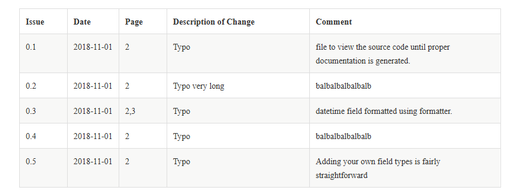

= Sara Documentation Composer

Software analysis and report automation.

Documentation composer part.

== Principles

You have to use *two* folders

* the standard folder where skelettons are located,
* the custom folder where custom modifications

Run the main command with

 python sara/cmd.py render --location=sara\templates --location=tmp\custom_templates --project=tmp/project.yml --document=tmp/document.yaml --template=software_review_master.adoc

It will produce a _asciidoc_ document based upon _templates/software_review_master.adoc_ itself based upon _templates/master.adoc_

----
= {{doc.title}}







body
----

Each include use a fragment, a reusable part of document

Fragment called _fragments/doc_issues_cartouche.adoc_ will produces an array from data

----
//
// Documentation lifecycle cartouche
//

[cols="1,1,1,3,4",stripes="none"]]
|=============================================
| *Issue* | *Date* | *Page* | *Description of Change* | *Comment*
//
| {{issue.id}} | {{issue.date}} | {{','.join(issue.page)}} | {{issue.description}} | {{issue.comment}}
//
|=============================================
----

You could focus on the "for in loop", that iterates over a list of issues associated to document.

Issues are stored as part of a document definition :

[source,yaml]
----
title: document title
version: '1.0'
date: 2019-01-30
reference: REC-FOO-A
custodian: mister.custodian
#...
issues:
  - id: '0.1'
    description: Typo
    date: '2018-11-01'
    comment: file to view the source code until proper documentation is generated.
    page:
      - '2'
  - id: '0.2'
    description: Typo very long
    date: '2018-11-01'
    comment: balbalbalbalbalb
    page:
    - '2'
  - id: '0.3'
    description: Typo
    date: '2018-11-01'
    comment: datetime field formatted using formatter.
    page:
    - '2'
    - '3'
----

The asciidoc generated text will be

----
[cols="1,1,1,3,4",stripes="none"]]
|=============================================
| *Issue* | *Date* | *Page* | *Description of Change* | *Comment*
//
| 0.1 | 2018-11-01 | 2 | Typo | file to view the source code until proper documentation is generated.
//
| 0.2 | 2018-11-01 | 2 | Typo very long | balbalbalbalbalb
//
| 0.3 | 2018-11-01 | 2,3 | Typo | datetime field formatted using formatter.
//
|=============================================
----

This renders as

== How to install

. clone git repository
+
[source,bash]
----
git clone https://github.com/SaraOrganization/sara-documentation-composer.git
----
+
. Change directory
+
[source,bash]
----
cd sara-documentation-composer/
----
+
. Create a virtual env
+
[source,bash]
----
python -m venv ./venv
----
+
. Activate the virtual env
.. Linux
+
[source,bash]
----
source ./venv/bin/activate
----
+
.. Windows
+
[source,bash]
----
./venv/Scripts/activate
----
+
. Install dependencies
+
[source,bash]
----
pip install -r requirements.txt
----

+
. Run the demo
+
[source,bash]
----
python sara/cmd.py render --location=sara/templates --project=demo/project.yml --document=demo/document.yaml --template=software_review_master.adoc
----
